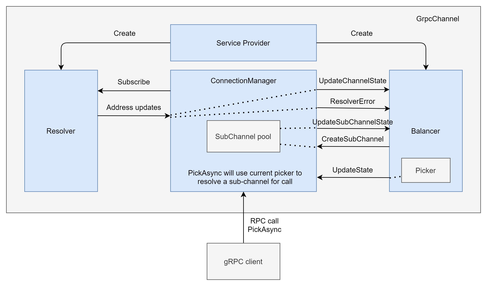

Title
----
* Author(s): James Newton-King
* Approver: jtattermusch and markdroth
* Status: Draft
* Implemented in: csharp
* Last updated: 2021-05-19
* Discussion at: <google group thread> (filled after thread exists)

## Abstract

grpc-dotnet currently has no load balancing support. A channel is always created for a single address.

This documentation outlines an initial load balancing implementation for the grpc-dotnet client.

## Background

grpc-dotnet currently doesn't support any form of load balancing in the client. The changes outlined in this proposal will enable basic gRPC load balancing and some of its related features. These include:

* Name resolving. There is built-in support for resolving from DNS, and a static resolver. Can create custom resolvers.
* Load balancing strategies. Includes built-in support for pick first and round-robin load balancing. Can create custom load balancers.
* Connectivity status at sub-channel and channel level
* Wait for ready

## Proposal



### Initialization

Channels are created with:

* An address
* An optional service provider
* An optional service config

```csharp
var channel = GrpcChannel.ForAddress(
    "dns:///backend.default.svc.cluster.local",
    new GrpcChannelOptions { ChannelCredentials = ChannelCredentials.Insecure });
var client = new Greet.GreeterClient(channel);

var response = await client.SayHelloAsync(new HelloRequest { Name = "world" });
Console.WriteLine(response.Message);
```

* Resolver is created from address scheme.
  * Existing logic allows for `http` and `https`. These schemes are special-cased to never use a resolver.
  * A collection of resolver factories are fetched from the service provider. One is selected using the address scheme, and it will create a resolver. For example, `dns` will match to `DnsAddressResolverFactory`, creating a `DnsAddressResolver`.
* Load balancer is created from the load balancer name in service config.
  * A collection of load balancer factories are fetched from the service provider. One is selected using the configured name (if none specified, then `pick_first` is used), creating a load balancer.
  * Load balancer is initialized with an `IChannelController` instance by the channel. The controller calls back to the channel to create sub-channels and update the picker.

### Connecting

* No network activity until `GrpcChannel.ConnectAsync` is called, or the first RPC is started.
* On connect, the `ConnectionManager` starts the resolver and prompts it to run immediately.
* Resolver pushes addresses and optional service config to `ConnectionManager`.
* Load balancer is created.
  * Resolver can return a service config. If `DisableServiceConfig` is not `true` then the resolver's service config is used to get load balancer policy.
  * Channel service config option is used as a fallback.
  * When no load balancer policy has been specified then a `PickFirstLoadBalancer` is created.
* Balancer uses `IChannelController` to create, remove or update sub-channels as needed based on the addresses.
  * A new sub-channel starts connecting when `SubChannel.RequestConnection()` is called. Sub-channels shut down when disposed.
* Balancer is notified of changes in sub-channel state. It will create a `SubChannelPicker` based on the current state.

### Picking

* `ConnectionManager.PickAsync` is called to get a ready sub-channel along with the sub-channel's connected address.
* If a picker hasn't been set yet, or the picker is empty, or the picker has an error then `PickAsync` will wait for a picker with a ready sub-channel if `WaitForReady` has been set. If `WaitForReady` is not set, then the error will be thrown back to the caller.

### Connectivity

* Channel supports standard connectivity APIs and follows closely what `Grpc.Core` does:
  * `State` property to get `ConnectivityState`
  * `ConnectAsync()` to explicitly move to a ready state
  * `WaitForStateChangeAsync`
* Limitation of connectivity support are imposed by missing .NET APIs:
  * On .NET 5 and later only transport connectivity (i.e. can we create a TCP socket to the address) is taken into account. Missing support for validating the TLS handshake and HTTP/2 connection negotiation.
  * Older versions of .NET Core don't have transport connectivity. Have to fallback to inferring connectivity by observing whether gRPC calls fail because of socket or IO related errors.

## Rationale

* Design shares the most in common with grpc-go. SubChannels have a collection of addresses and are responsible for staying connected and retrying when in TRANSIENT_FAILURE.
* Goal is to support basic gRPC load balancing using DNS in Kubernetes.
* Secondary goal is to have a design in place that can be used to implement xDS in the future with minimal changes.
* All load balancing APIs will be marked as experimental.
* API design of resolver and load balancer purposefully chooses not to use static configuration. This is considered an anti-pattern in .NET. Instead, custom resolver and load balancer factories are registered with a DI container which is then hooked up to the gRPC channel using `GrpcChannelOptions.ServiceProvider`.

## Implementation

Implementation is in the grpc-dotnet repo: [PR #1286](https://github.com/grpc/grpc-dotnet/pull/1286).

```csharp
namespace Grpc.Net.Client {
    public sealed class GrpcChannelOptions {
        public bool DisableResolverServiceConfig { get; set; }
        public IServiceProvider? ServiceProvider { get; set; }
    }
    public sealed class GrpcChannel : ChannelBase, IDisposable {
        public Task ConnectAsync(CancellationToken cancellationToken = default);
        public ConnectivityState State { get; }
        public Task WaitForStateChangedAsync(ConnectivityState lastObservedState, CancellationToken cancellationToken = default);
    }
    public enum ConnectivityState {
        Idle = 0,
        Connecting = 1,
        Ready = 2,
        TransientFailure = 3,
        Shutdown = 4,
    }
}
    
namespace Grpc.Net.Client.Balancer {
    public sealed class ResolverOptions {
        public ResolverOptions(bool disableServiceConfig);
        public bool DisableServiceConfig { get; }
    }
    public class SubchannelOptions {
        public SubchannelOptions(IReadOnlyList<DnsEndPoint> addresses);
        public IReadOnlyList<DnsEndPoint> Addresses { get; }
    }
    public interface IConnectionController {
        Subchannel CreateSubchannel(SubchannelOptions options);
        void RefreshResolver();
        void UpdateState(BalancerState state);
    }
    public sealed class BalancerAttributes : IDictionary<string, object?>, ICollection<KeyValuePair<string, object?>>, IEnumerable<KeyValuePair<string, object?>>, IEnumerable {
        public BalancerAttributes();
        public static readonly BalancerAttributes Empty;
        int ICollection<KeyValuePair<string, object>>.Count { get; }
        bool ICollection<KeyValuePair<string, object>>.IsReadOnly { get; }
        object? IDictionary<string, object>.Item[string key] { get; set; }
        ICollection<string> IDictionary<string, object>.Keys { get; }
        ICollection<object?> IDictionary<string, object>.Values { get; }
        public void Set<TValue>(BalancerAttributesKey<TValue> key, TValue value);
        public bool TryGetValue<TValue>(BalancerAttributesKey<TValue> key, out TValue value);
        void ICollection<KeyValuePair<string, object>>.Add(KeyValuePair<string, object?> item);
        void ICollection<KeyValuePair<string, object>>.Clear();
        bool ICollection<KeyValuePair<string, object>>.Contains(KeyValuePair<string, object?> item);
        void ICollection<KeyValuePair<string, object>>.CopyTo(KeyValuePair<string, object?>[] array, int arrayIndex);
        bool ICollection<KeyValuePair<string, object>>.Remove(KeyValuePair<string, object?> item);
        void IDictionary<string, object>.Add(string key, object? value);
        bool IDictionary<string, object>.ContainsKey(string key);
        object? IDictionary<string, object>.get_Item(string key);
        bool IDictionary<string, object>.Remove(string key);
        void IDictionary<string, object>.set_Item(string key, object? value);
        bool IDictionary<string, object>.TryGetValue(string key, out object? value);
        IEnumerator<KeyValuePair<string, object?>> IEnumerable<KeyValuePair<string, object>>.GetEnumerator();
        IEnumerator IEnumerable.GetEnumerator();
    }
    public readonly struct BalancerAttributesKey<TValue> {
        public BalancerAttributesKey(string key);
        public string Key { get; }
    }
    public class BalancerState {
        public BalancerState(ConnectivityState connectivityState, SubchannelPicker picker);
        public ConnectivityState ConnectivityState { get; }
        public SubchannelPicker Picker { get; }
    }
    public class ChannelState {
        public ChannelState(Status status, IReadOnlyList<DnsEndPoint>? addresses, LoadBalancingConfig? loadBalancingConfig, BalancerAttributes attributes);
        public IReadOnlyList<DnsEndPoint>? Addresses { get; }
        public BalancerAttributes Attributes { get; }
        public LoadBalancingConfig? LoadBalancingConfig { get; }
        public Status Status { get; }
    }
    public class CompleteContext {
        public CompleteContext();
        public Exception? Error { get; set; }
        public Metadata? Trailers { get; set; }
    }
    public sealed class DnsResolver : Resolver {
        public DnsResolver(Uri address, ILoggerFactory loggerFactory, TimeSpan refreshInterval);
        public override Task RefreshAsync(CancellationToken cancellationToken);
        public override void Start(Action<ResolverResult> listener);
        protected override void Dispose(bool disposing);
    }
    public class DnsResolverFactory : ResolverFactory {
        public DnsResolverFactory(ILoggerFactory loggerFactory, TimeSpan refreshInterval);
        public override string Name { get; }
        public override Resolver Create(Uri address, ResolverOptions options);
    }
    public abstract class LoadBalancer : IDisposable {
        protected LoadBalancer();
        public void Dispose();
        public abstract void RequestConnection();
        public abstract void UpdateChannelState(ChannelState state);
        public abstract void UpdateSubchannelState(Subchannel subchannel, SubchannelState state);
        protected virtual void Dispose(bool disposing);
    }
    public abstract class LoadBalancerFactory {
        protected LoadBalancerFactory();
        public abstract string Name { get; }
        public abstract LoadBalancer Create(IConnectionController controller, IDictionary<string, object> options);
    }
    public class PickContext {
        public PickContext();
        public HttpRequestMessage? Request { get; set; }
    }
    public class PickFirstBalancer : LoadBalancer {
        public PickFirstBalancer(IConnectionController channel, ILoggerFactory loggerFactory);
        public override void RequestConnection();
        public override void UpdateChannelState(ChannelState state);
        public override void UpdateSubchannelState(Subchannel subchannel, SubchannelState state);
        protected override void Dispose(bool disposing);
    }
    public class PickFirstBalancerFactory : LoadBalancerFactory {
        public PickFirstBalancerFactory(ILoggerFactory loggerFactory);
        public override string Name { get; }
        public override LoadBalancer Create(IConnectionController controller, IDictionary<string, object> options);
    }
    public class PickResult {
        public Status Status { get; }
        public Subchannel? Subchannel { get; }
        public static PickResult ForError(Status status);
        public static PickResult ForNoResult();
        public static PickResult ForSubchannel(Subchannel subchannel, Action<CompleteContext>? onComplete = null);
        public void Complete(CompleteContext context);
    }
    public abstract class Resolver : IDisposable {
        protected Resolver();
        public void Dispose();
        public abstract Task RefreshAsync(CancellationToken cancellationToken);
        public abstract void Start(Action<ResolverResult> listener);
        protected virtual void Dispose(bool disposing);
    }
    public abstract class ResolverFactory {
        protected ResolverFactory();
        public abstract string Name { get; }
        public abstract Resolver Create(Uri address, ResolverOptions options);
    }
    public class ResolverResult {
        public IReadOnlyList<DnsEndPoint>? Addresses { get; }
        public BalancerAttributes Attributes { get; }
        public ServiceConfig? ServiceConfig { get; }
        public Status? Status { get; }
        public static ResolverResult ForError(Status status);
        public static ResolverResult ForResult(IReadOnlyList<DnsEndPoint> addresses, ServiceConfig? serviceConfig);
    }
    public class RoundRobinBalancer : SubchannelsLoadBalancer {
        public RoundRobinBalancer(IConnectionController channel, ILoggerFactory loggerFactory);
        protected override SubchannelPicker CreatePicker(List<Subchannel> readySubchannels);
    }
    public class RoundRobinBalancerFactory : LoadBalancerFactory {
        public RoundRobinBalancerFactory(ILoggerFactory loggerFactory);
        public override string Name { get; }
        public override LoadBalancer Create(IConnectionController controller, IDictionary<string, object> options);
    }
    public class StaticResolver : Resolver {
        public StaticResolver(IEnumerable<DnsEndPoint> addresses);
        public override Task RefreshAsync(CancellationToken cancellationToken);
        public override void Start(Action<ResolverResult> listener);
        protected override void Dispose(bool disposing);
    }
    public class StaticResolverFactory : ResolverFactory {
        public StaticResolverFactory(IEnumerable<DnsEndPoint> addresses);
        public override string Name { get; }
        public override Resolver Create(Uri address, ResolverOptions options);
    }
    public class Subchannel : IDisposable {
        public BalancerAttributes Attributes { get; }
        public DnsEndPoint? CurrentEndPoint { get; }
        public ConnectivityState State { get; }
        public void Dispose();
        public IList<DnsEndPoint> GetAddresses();
        public void RequestConnection();
        public void UpdateAddresses(IReadOnlyList<DnsEndPoint> addresses);
        public override string ToString();
    }
    public abstract class SubchannelPicker {
        protected SubchannelPicker();
        public abstract PickResult Pick(PickContext context);
    }
    public abstract class SubchannelsLoadBalancer : LoadBalancer {
        protected SubchannelsLoadBalancer(IConnectionController controller, ILoggerFactory loggerFactory);
        protected IConnectionController Controller { get; }
        protected ConnectivityState State { get; }
        public override void RequestConnection();
        public override void UpdateChannelState(ChannelState state);
        public override void UpdateSubchannelState(Subchannel subchannel, SubchannelState state);
        protected abstract SubchannelPicker CreatePicker(List<Subchannel> readySubchannels);
        protected override void Dispose(bool disposing);
    }
    public class SubchannelState {
        public SubchannelState(ConnectivityState state, Status status);
        public ConnectivityState State { get; }
        public Status Status { get; }
    }
}
```

## Open issues (if applicable)

* ~There is a race condition between a picker returning a ready sub-channel and it being used, and the sub-channels state or address changes. For this reason, a picker will return a sub-channel along with its current address when it is marked as ready.~
* DNS support in .NET doesn't support getting service config from DNS. ~Resolver updating the service config is not part of the current design. Can change if desired.~
